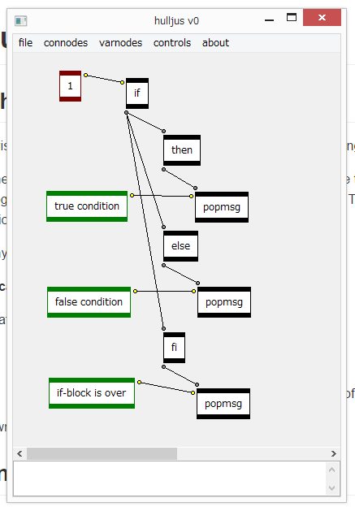

# hulljus

## a picture is worth a thousand words

>

>_a rather innocent-looking if-block implementation in hulljus_

## what is this?

A visual programming interface which by itself contains something more or less like a programming language.

When you use the name _hulljus_ (nobody really does so because this project is so not known), you can be referring to the programming interface itself or the quasi-programing language. This vague reference is so like another better known project which I need not name here.

Why?

__Because it's much better known__.

A rather detailed (and possibly incomplete) documentation of:

*	all features available in the program;
*	all features of the quasi-programming language; and
*	all one needs to know in order to implement an interpreter of the quasi-programming language

is written in the file `hulljus/documentation.md`.

## onomastics: behind the name

Honestly I really forgot.

What I can tell as far as possible is that it's some sort of a portmanteau of Swedish words, particularly a concatenation of 2 words.

The problem is, I don't where to split the 7 letters into 2 groups of each word. _jus_ is juice, and _ljus_ is light. Either way, _hul(l)_ doesn't make sense. So maybe it's a mix of 2 words from 2 different language. But I'm quite sure that the latter is Swedish.

## dependencies & compilation

You need [wxWidgets 3.1.0](http://wxwidgets.org/) and [Boost](http://boost.org). But Boost is hardly ever used in this project; I will consider delete this dependency completely from the code.

If you have __Visual Studio Community 2015__, use it to open the `.vcxproj` file. In _Additional Include Directories_, replace `%WXWIN%` and `%BOOSTDIR%` with your directories to wxWidgets and Boost. `%WXWIN%` also appears in _Additional Library Directories_. Boost is header-only so has nothing to do with libraries.

Wait as I come up with instructions for non-VS users.

## anything else?

I use the absolutely amazing Visual Studio Community 2015 and initiated my VS project with Git. When I uploaded everything from my local repository to this Github repository (which is what I did in the glorious first commit), I was surprised by the fact that VS generated a `.gitignore` for me. Sadly, There was one file that should have been included as well, but was not - the `Thumbs.db`. And the VS developers, they are really from Microsoft...